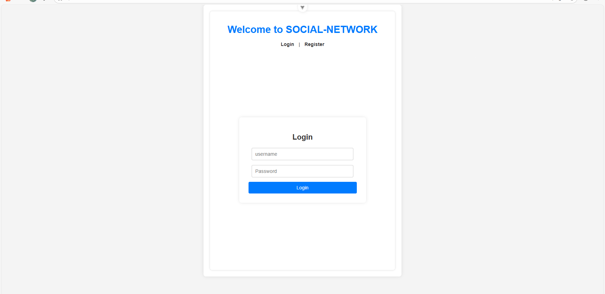
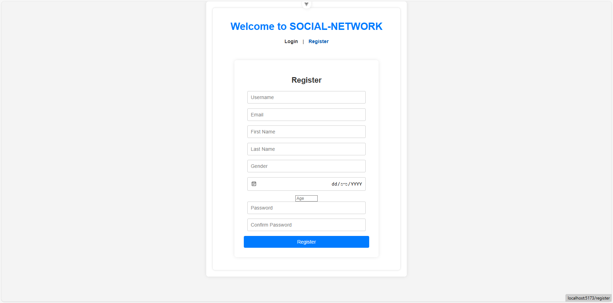
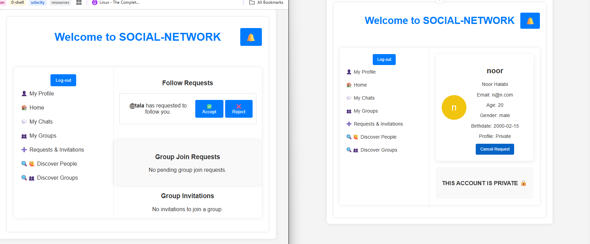
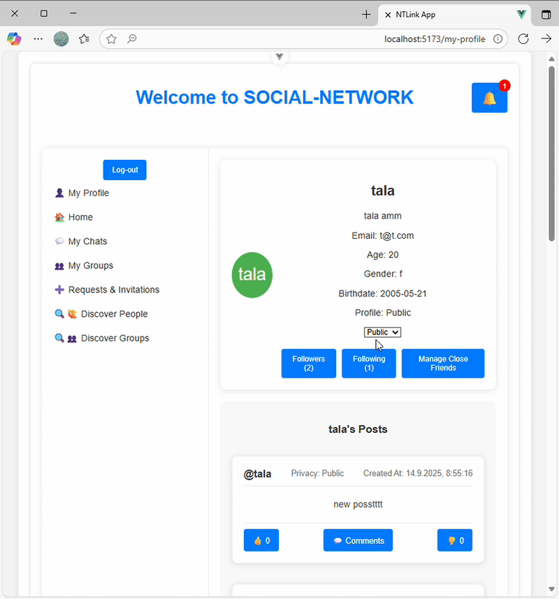
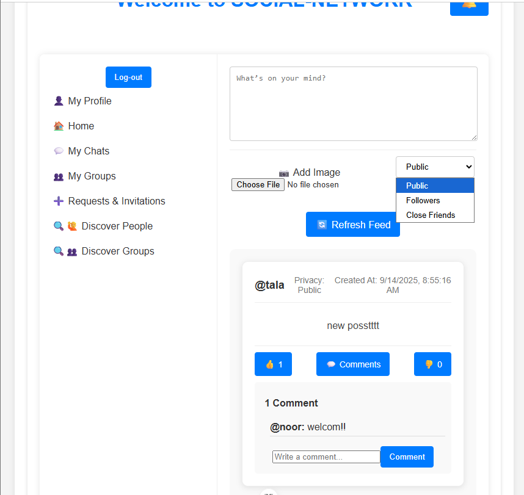
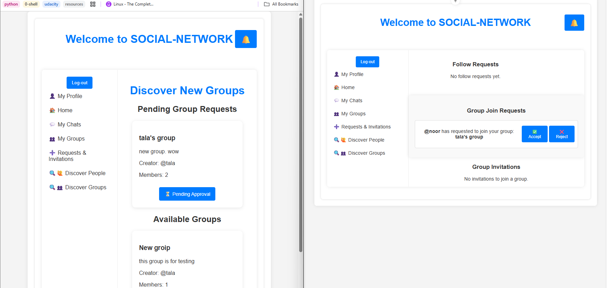
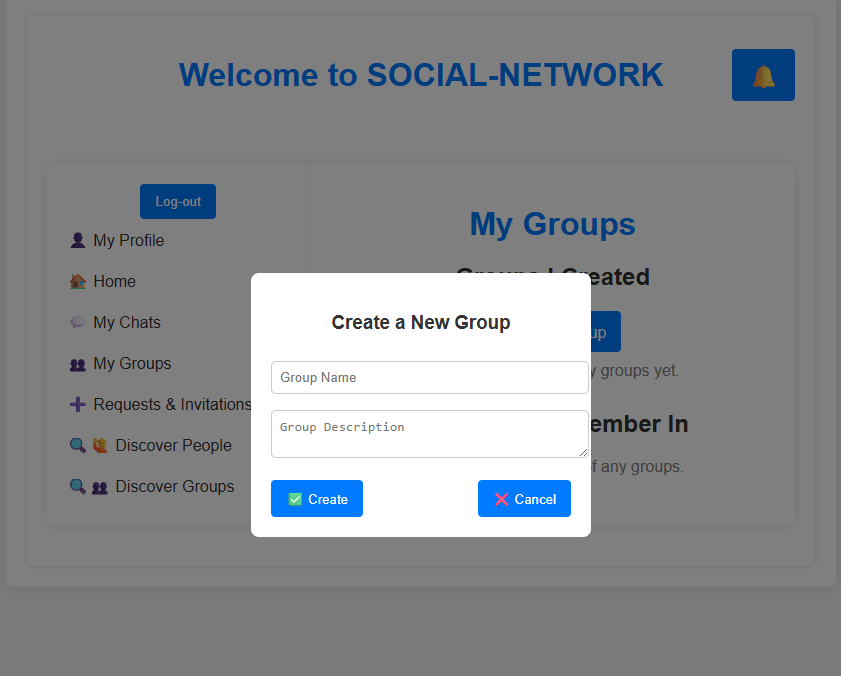
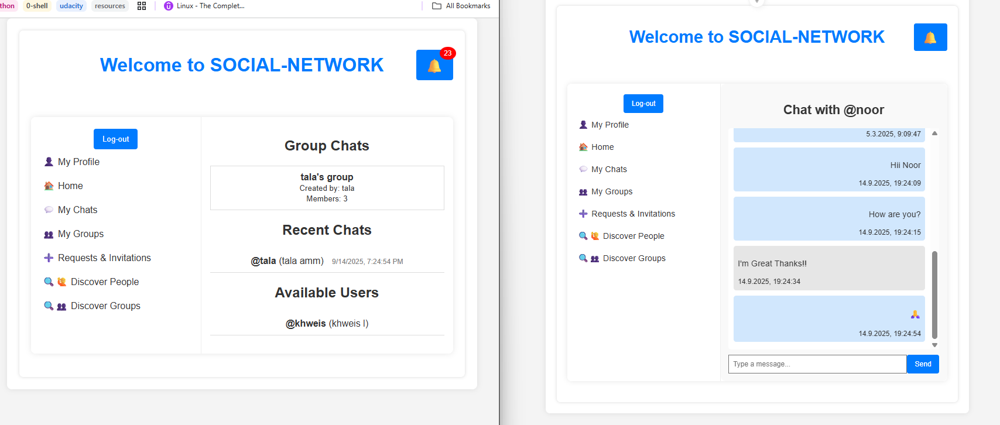
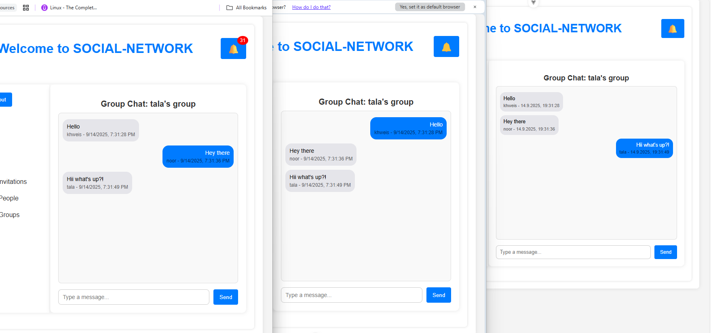
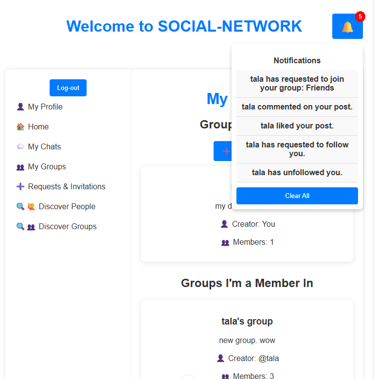

# Social Network

[Project Description (01-edu)](https://github.com/01-edu/public/tree/master/subjects/social-network)

## Overview

This repository contains a **Facebook-like social network** built as a group project for the Notre Dame Full Stack Course. The project was developed using a modern stack with a **Go backend** and a **Vue.js frontend**, containerized using Docker, and using **SQLite** for persistent storage.

> **Note:** This project was managed using [Gitea](https://gitea.io/), so the commit history here does not fully reflect each member's contributions.

---

## Team Members

This was a group project. The team members are:

- ([Noor Halabi](https://adam-jerusalem.nd.edu/git/noorhalabi911))
- ([Tala Amm](https://adam-jerusalem.nd.edu/git/talaamm))
- ([Amro Khweis](https://adam-jerusalem.nd.edu/git/akhweis7))
- ([Moaz Razem](https://adam-jerusalem.nd.edu/git/mrazem))
- ([Mohamed Natsheh](https://adam-jerusalem.nd.edu/git/mnatsheh))
- ([Zaki Awadallah](https://adam-jerusalem.nd.edu/git/zawadall))

**My Role:** I was the **team leader** and **integration engineer**, responsible for connecting all the parts together and ensuring smooth collaboration and integration across the backend, frontend, and database.

---

## Features

- **Authentication:** Registration and login with sessions and cookies. Supports email, password, first/last name, age, date of birth, and a username.




- **Followers:** Users can follow/unfollow others. Private profiles require approval for follow requests.



- **Profiles:** Public/private profiles, user info, posts, followers/following/close friends lists, privacy toggle.



- **Posts:** Create posts with images/GIFs, set privacy (public, followers, selected users), comment and like/dislike on posts.



- **Groups:** Create groups, invite users, accept/reject invitations, request to join, group posts/comments/likes, group name/description/creator, group events with RSVP, vote for events as going/not going, view group members, leave groups, group creator will delete the group if they leave.





- **Chats:** Private messaging via WebSockets between users who follow each other or have public profiles. Group chat rooms for group members.




- **Notifications:** Real-time notifications for follow requests, group invitations, group join requests, new group events, and more.



- **Migrations:** All database schema changes are managed via migrations for easy setup and testing.
- **Dockerized:** Both backend and frontend are containerized for easy deployment and development.

---

## Tech Stack

- **Backend:** Go (Golang), Gorilla WebSocket, SQLite, bcrypt, golang-migrate
- **Frontend:** Vue.js, JavaScript, HTML, CSS
- **Database:** SQLite (with migrations)
- **Containerization:** Docker (separate containers for backend and frontend)

---

## Folder Structure

```
.
├── docker-compose.yml
├── backend/
│   ├── dockerfile
│   ├── go.mod
│   ├── go.sum
│   ├── main.go
│   ├── data/
│   │   └── social-network.db
│   ├── internal/
│   │   ├── config/
│   │   ├── handlers/
│   │   ├── middlewars/
│   │   ├── models/
│   │   ├── repositories/
│   │   └── websocket/
│   ├── migrations/
│   │   ├── 000001_create_users_table.up.sql
│   │   ├── 000002_create_posts_table.up.sql
│   │   └── ...
│   └── uploads/
├── frontend/
│   ├── dockerfile
│   ├── index.html
│   ├── package.json
│   ├── vite.config.js
│   └── src/
│       ├── App.vue
│       └── ...
```

---

## Running the Project

1. **Clone the repository:**

   ```sh
   git clone https://github.com/talaamm/Social-Network-March2025.git
   cd social-network
   ```

2. **Build and run**
   - with Docker Compose:

      ```sh
      docker-compose up --build
      ```

      - The backend and frontend will be available on their respective ports (see `docker-compose.yml`).
   - run locally

      ```sh
      # in terminal 1
      cd ./backend
      go run .
      ```

      ```sh
      # in terminal 2
      cd ./frontend
      npm install
      npm run dev
      ```

---

## Future Improvements

- Sync age with birthdate automatically.
- Add password strength criteria.
- Allow Login with email/ github
- Improve notifications UI.
- Add ability to upload a profile picture.
- Add about me section
- Require valid gender selection (currently free text).
- Improve general UI and optimize code wherever possible.

---

## Notes

- All migrations are stored in `backend/migrations/` and are applied automatically on backend startup.
- Images are stored in the filesystem, with paths saved in the database.
- WebSockets are used for real-time chat and notifications.
- For a full project description and requirements, see [the official subject page](https://github.com/01-edu/public/tree/master/subjects/social-network).

---

## License

This project is under the MIT License. It is for educational purposes as part of the Notre Dame Full Stack ADAM Course.
